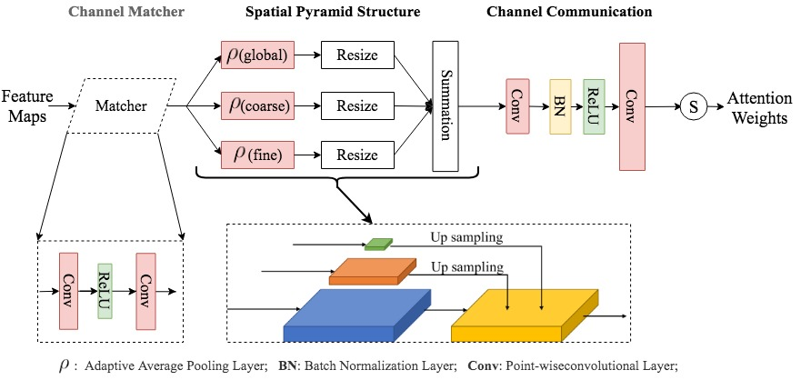

# Spatial Pyramid Attention for Deep Convolutional Neural Networks
[Xu Ma](https://13952522076.github.io/), Jingda Guo, Andrew Sansom, Mara McGuire, Andrew Kalaani, Qi Chen, Sihai Tang, [Qing Yang](https://www.cse.unt.edu/~qingyang/), [Song Fu*](https://www.cse.unt.edu/~song/)


## SPA module




## Getting Start
### Installation

 __1. Download repo__
 
```Bash
git clone https://github.com/13952522076/SPANet_TMM.git
cd SPANet_TMM
```

__2. Requirements__

- Python3.6
- PyTorch 1.3+
- CUDA 10+
- GCC 5.0+
```Bash
pip install -r requirements.txt
```
__3. Install DALI and Apex （For ImageNet Training）__

DALI Installation:
```Bash
cd ~
# For CUDA10
pip install --extra-index-url https://developer.download.nvidia.com/compute/redist nvidia-dali-cuda100
# or
# For CUDA11
pip install --extra-index-url https://developer.download.nvidia.com/compute/redist nvidia-dali-cuda110
```
For more details, please see [Nvidia DALI installation](https://docs.nvidia.com/deeplearning/dali/user-guide/docs/installation.html).


Apex Installation:
```Bash
cd ~
git clone https://github.com/NVIDIA/apex
cd apex
pip install -v --no-cache-dir --global-option="--cpp_ext" --global-option="--cuda_ext" ./
```
For more details, please see [Apex](https://github.com/NVIDIA/apex) or [Apex Full API documentation](https://nvidia.github.io/apex/).


<!--__Prepare ImageNet dataset__-->

<!--```Bash-->
<!--cd ~-->
<!--cd Efficient_ImageNet_Classification-->
<!--mkdir data-->
<!--cd data-->
<!--# Replace PATH_TO_ImageNet to your ImageNet dataset path-->
<!--ln -s PATH_TO_ImageNet imagenet-->
<!--```-->

## Training & Testing ImageNet
We provide two training strategies: step_lr schedular and cosine_lr schedular in [main.py](https://github.com/13952522076/SPANet_TMM/blob/master/main.py) and [main_mobile.py](https://github.com/13952522076/SPANet_TMM/blob/master/main_mobile.py) respectively.

The training models (last one and best one) and the log file  are saved in "checkpoints/imagenet/`model_name`" by default.
***

I personally suggest to manually setup the path to imagenet dataset in [main.py (line 49)](https://github.com/13952522076/SPANet_TMM/blob/fbe4f4911225c094aac175ac597dafe6168fd50d/main.py#L49) 
and [main_mobile.py (line 50)](https://github.com/13952522076/SPANet_TMM/blob/fbe4f4911225c094aac175ac597dafe6168fd50d/main_mobile.py#L50).
Replace the default value to your real PATH.

Or you can add a parameter `--data` in the following training command.


**For the step learning rate schedular, run follwing commands**
```Bash
# change the parameters accordingly if necessary
# e.g, If you have 4 GPUs, set the nproc_per_node to 4. If you want to train with 32FP, remove ----fp16.
python3 -m torch.distributed.launch --nproc_per_node=8 main.py -a spa_resnet50 --fp16 --b 32
```
**For the cosine learning rate schedular, run follwing commands**
```Bash
# change the parameters accordingly if necessary
python3 -m torch.distributed.launch --nproc_per_node=8 main_mobile.py -a spa_resnet18 --b 64 --opt-level O0
```

## Training & Testing Downsampled ImageNet
```Bash
python3 downsample.py --netName=SPAResNet18 --bs=512
```

## Training & Testing CIFAR
```Bash
python3 cifar.py --netName=SPAResNet18 --cifar=100 --bs=512
```


## Calculate Parameters and FLOPs
```Bash
python3 count_Param.py
```


## Citation

    @inproceedings{SPA2020Xu,
      title={Spanet: Spatial Pyramid Attention Network for Enhanced Image Recognition},
      author={Guo, Jingda and Ma, Xu and Sansom, Andrew and McGuire, Mara and Kalaani, Andrew and Chen, Qi and Tang, Sihai and Yang, Qing and Fu, Song},
      booktitle={2020 IEEE International Conference on Multimedia and Expo (ICME)},
      pages={1--6},
      year={2020},
      organization={IEEE}
    }

